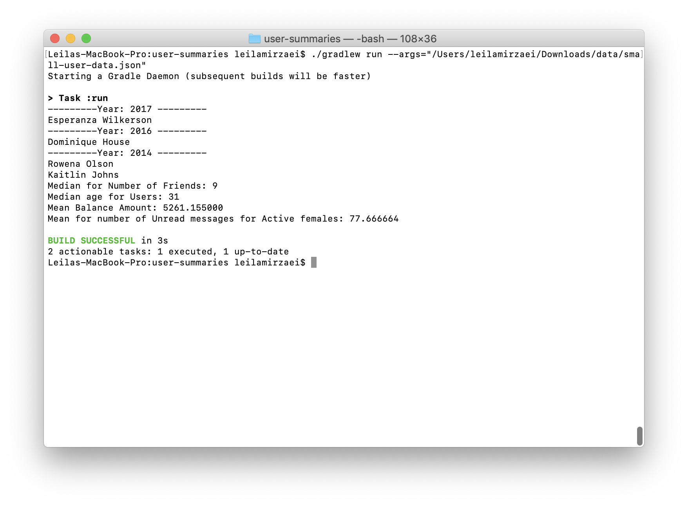
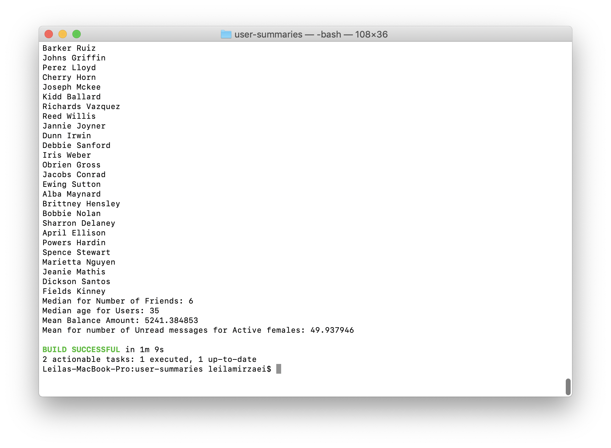

**Assumptions:**

* at each 1000 interval all the user records so far, from the begining, need to be processed by running the queries for all data
  * i.e. after reading 2000 records, the mean age of all 2000 records is printed
* the format of the "greeting" field is always in the form of: "Hello, (name)! You have (**unread message count**) unread messages." 
* the date format is the same for all date fields
* the gender value is either "female" or "male"
* for users registered in a year, only the user name is printed
* results are output to STDOUT

**How to run:**


To run the program, the path to the user data JSON file should be passed as an argument.

Ex.

`./gradlew run --args="small-user-data.json"`

**Screenshots**

* Screenshot of running with small-user-data file.



* Screenshot of running with users-1 file


**Approach**

We have a JSON file which contains information of users.
Each user has some properties like guid, age, email, favorite fruit, etc.

We are going to write a program to print the result of various queries.

To map user information to an object in the program, a class is created called `User`.

`User` class has these properties:

```java
private String guid;
private boolean isActive;
private String balance;
private Double balanceAmount = Double.MIN_VALUE;
private int age;
private String eyeColor;
private String name;
private Gender gender;
private String email;
private String phone;
private String address;
private Date registered;
private List<Friend> friends;
private String greeting;
private int unreadMessages = Integer.MIN_VALUE;
private String favoriteFruit;
```

All the properties are included in the user records JSON file, except the two properties `balanceAmount` and `unreadMessages`. These two properties are lazily evaluated (The value of them is obtained the first time their get method is called).

The gender property has two specific values: female and male. So, an enum class called `Gender` is added to represent these two constant values.

The next step to mapping user records from the JSON file to objects is reading the file (in stream mode), getting user elements and parsing them into `User` objects.

The Google Gson library is used to parse the JSON file.

```java
Gson gson = new GsonBuilder()
.setDateFormat("yyyy-mm-dd'T'HH:mm:ss' 'XXX")
.create();
```
The date format of the registered date property in user records differs from the default date format of Gson so, the `GsonBuilder` is used to construct a Gson instance with customized configuration for dates.

To designe queries such that adding new queries will be easy, an interface is created called `IQuery`. All the queries should implement this interface.
The `update` method of the `IQuery` interface keeps the users (or/and other data) in the way the query requires to complete it's processing.

The `evaluate` method runs the query process (here it is printing some information summary).

For running all the queries on user records the `UserDataProcessor` class is created.
In a while loop users are read from the JSON file one by one and added to a list.
After reading each 1000 records, run all the queries for users.
After each 1000 records the queries are run on all the user records that have been read so far.
